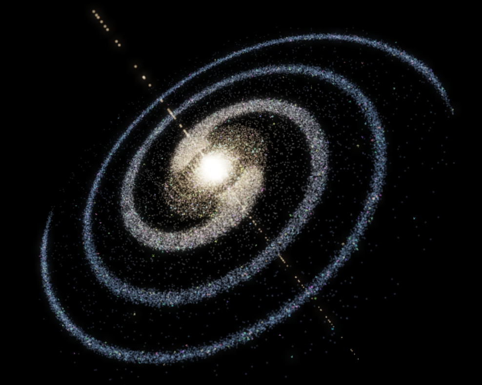
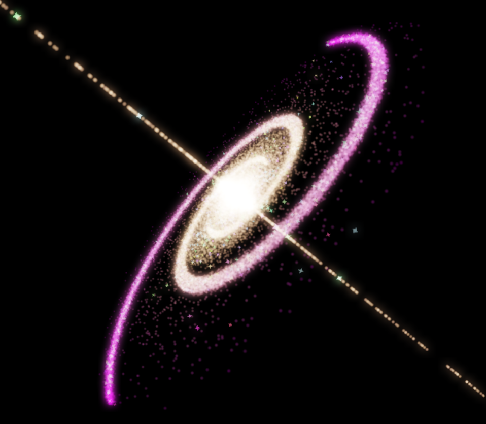
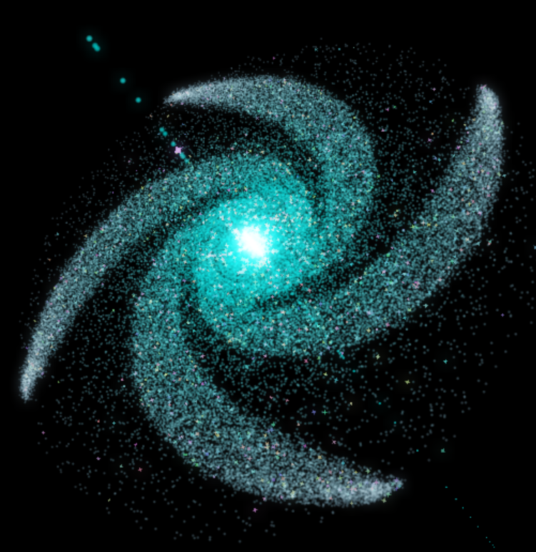
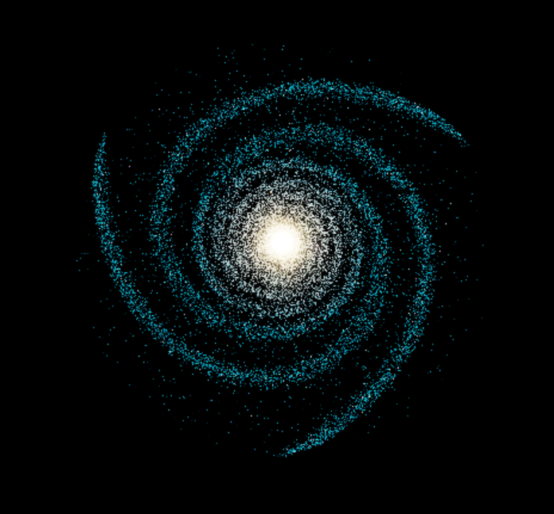
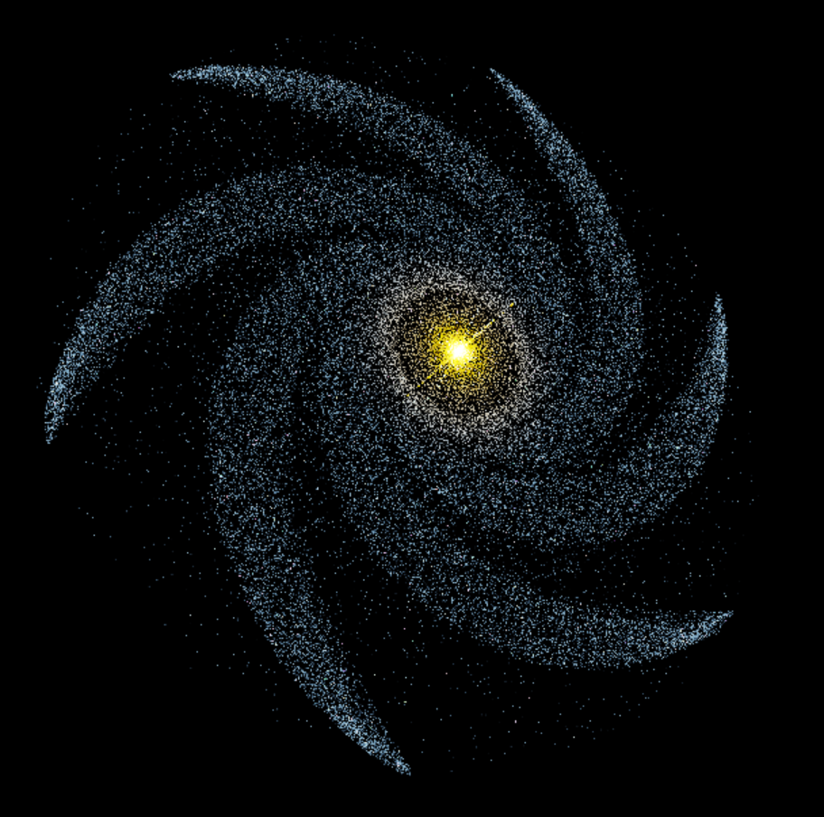
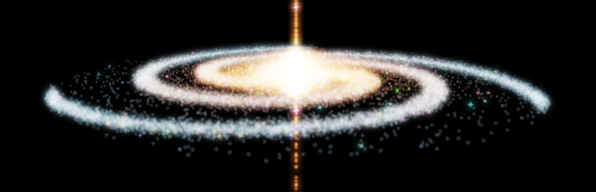

# 🌌 DirectX12 Galaxy Generator


<p align="center">
  <video
    src="images/reformationVid.mp4"
    poster="images/image1.png"
    width="1000"
    autoplay
    muted
    loop
    playsinline
    controls
    style="max-width: 100%; height: auto;"
  >
    <a href="images/reformationVid.mp4">
      Reformation demo (video)
    </a>
  </video>
</p>

A real-time particle galaxy built with **C++**, **DirectX 12**, and **HLSL**. The application generates a large field of particles, updates their motion on the GPU, and renders them as a glowing spiral galaxy that can be reshaped and viewed interactively.

The project is designed to make GPU-driven rendering easy to explore: move around the galaxy, change its spiral shape and motion, randomize its colors, and tune bloom and exposure while it is running.

## ✨ Key Features

- **Real-time particle galaxy simulation** updated on the GPU
- **Spiral-arm controls** for spin, winding, concentration, and differential rotation
- **Interactive 3D camera** with free movement and preset viewpoints
- **Galaxy color randomization** plus adjustable color gradients
- **HDR rendering and bloom** with live intensity, threshold, and exposure controls
- **Depth and debug controls** for inspecting particle rendering behaviour
- **Particle explosion and reformation** effects for reshaping the galaxy in real time
- **Frame-resource and fence synchronization** keeps CPU and GPU work coordinated safely across frames

## 🧭 How It Works

The rendering flow is intentionally straightforward at a high level:

```text
Initial particle field
        ↓
CPU setup + galaxy parameters
        ↓
GPU compute shader updates particle motion
        ↓
Particle rendering into the HDR scene
        ↓
Bloom extraction + blur
        ↓
Presentation / final image to the window
```

## 🖼️ Gallery

| | |
|:---:|:---:|
| [](images/reformationGif.gif) |  |
|  |  |
|  |  |
|  |   |

### 🎬 Reformation Demo

- [Watch animated preview (GIF)](images/reformationGif.gif)
- [Watch full video (GIF replacement)](images/reformationVid.mp4)
