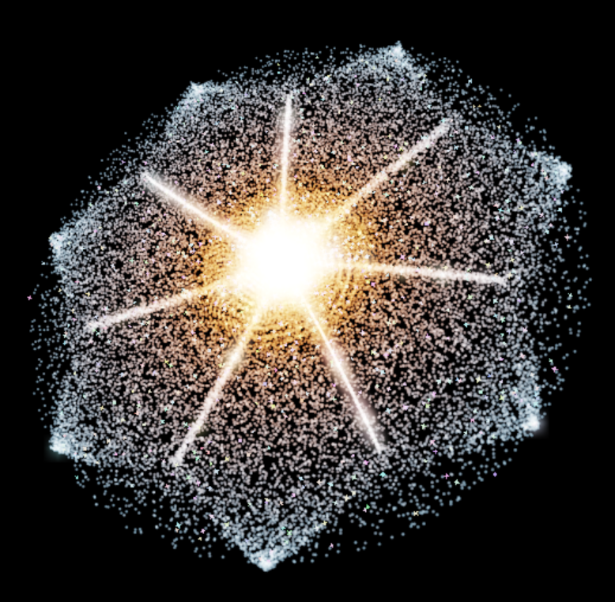

# 🌌 DirectX12 Galaxy Generator


<p align="center">
  
</p>

A real-time particle galaxy built with **C++**, **DirectX 12**, and **HLSL**. The application generates a large field of particles, updates their motion on the GPU, and renders them as a glowing spiral galaxy that can be reshaped and viewed interactively.

## ✨ Key Features

- **Real-time particle galaxy simulation** updated on the GPU
- **Spiral-arm controls** for spin, winding, concentration, and differential rotation
- **Interactive 3D camera** with free movement and preset viewpoints
- **Galaxy color randomization** plus adjustable color gradients
- **HDR rendering and bloom** with live intensity, threshold, and exposure controls
- **Depth and debug controls** for inspecting particle rendering behaviour
- **Particle explosion and reformation** effects for reshaping the galaxy in real time
- **Frame-resource and fence synchronization** keeps CPU and GPU work coordinated safely across frames

## 🧭 How It Works

The rendering flow is intentionally straightforward at a high level:

```text
Initial particle field
        ↓
GPU compute shader updates particle motion
        ↓
Particles render into an HDR scene
        ↓
Bloom extraction + blur
        ↓
Presentation / final image to the window
```

## 📐 Core Simulation Math

A few simple equations drive the galaxy's shape and particle motion.

### Logarithmic Spiral

```text
r = a · e^(bθ)
```

**Purpose:** Defines the shape of the galaxy's spiral arms.

* `r` = distance from the centre
* `θ` = angle around the centre
* `a` = starting scale
* `b` = how tightly the spiral winds

Changing these values changes how open or tightly wound the galaxy appears.

### Orbital Velocity

```text
v = ω × r
```

**Purpose:** Gives particles their sideways motion around the galactic centre.

* `r` = position relative to the centre
* `ω` = angular velocity
* `v` = resulting orbital velocity

Different parts of the galaxy can rotate at different speeds, which helps create more natural-looking motion.

### Centripetal Acceleration

```text
a = -ω²r
```

**Purpose:** Pulls particle motion inward so particles curve around the centre instead of travelling in a straight line.

The negative direction means the acceleration points back toward the galactic centre.

### Particle Update

```text
velocity += acceleration · Δt
position += velocity · Δt
```

**Purpose:** Advances every particle through the simulation over time.


## 🖼️ Gallery

| | |
|:---:|:---:|
| [](images/reformationGif.gif) |  |
|  |  |
|  |  |
|  | [](images/reformationGif.gif) |

`Δt` is the amount of simulation time that passed since the previous update. These calculations run across many particles in parallel on the GPU.
